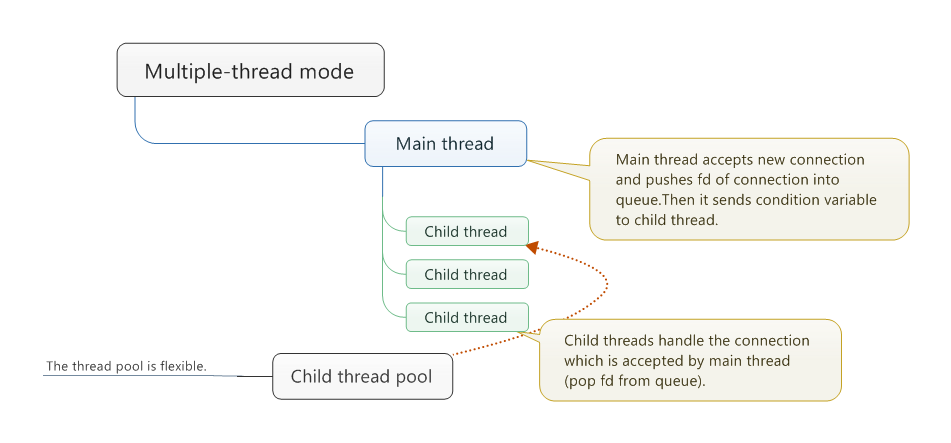
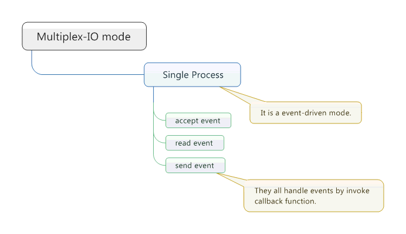
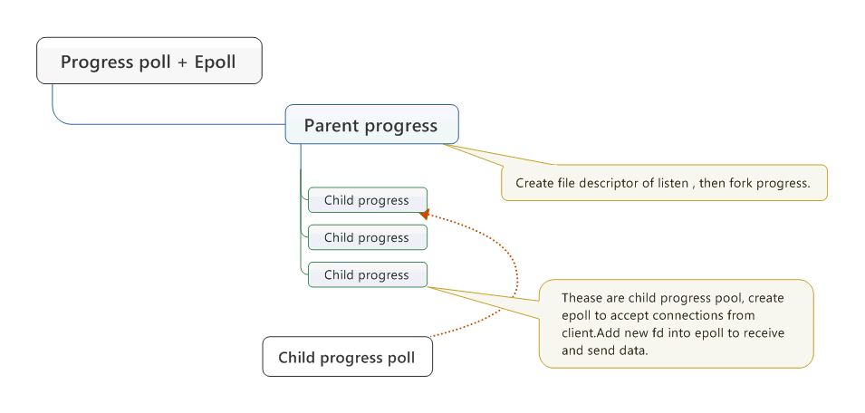

Concurrent Server of TCP
---

###server1
Is is multiple-threaded mode.Main thread accepts new connection, and child threads handle the connection.And the *thread pool is flexible*.`srv_socket_rev() ` function uses `select` to  realize multiplex IO. Its client is client1.

```shell

#etc: ./server1 -t 15 
./server1  [-t number of child thread]

```

###server2
Is is multiple-threaded mode.Main thread accepts new connection, and child threads handle the connection.And the *thread pool is flexible*.`srv_socket_rev() ` function don't uses `select` to  realize multiplex IO.Its client is client1.

```shell

#etc: ./server2 -t 15 
./server2  [-t number of child thread]

```
<center></center>
<div align = "center">server2 structure</div>

###server3
It is multiplex-IO mode (epoll) .Only a progress handles connections from client.Its client is client3.

<center></center>
<div align = "center">server3 structure</div>

###server4
It is multi-process mode + multiplex-IO mode (epoll) .Parent progress create file descriptor of listen and then fork child progress.Child progress creates epoll to wait events to happen.Its client is client3.

<center> </center>
<div align = "center">server4 structure</div>
