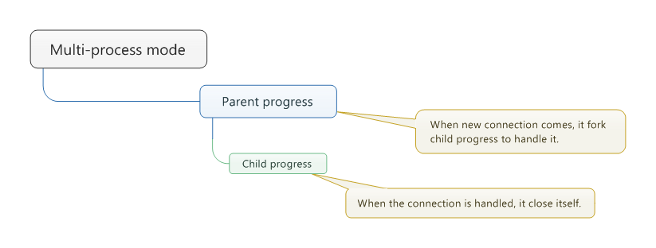
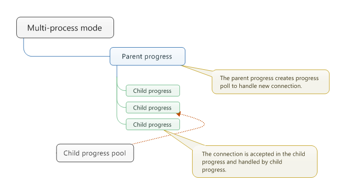
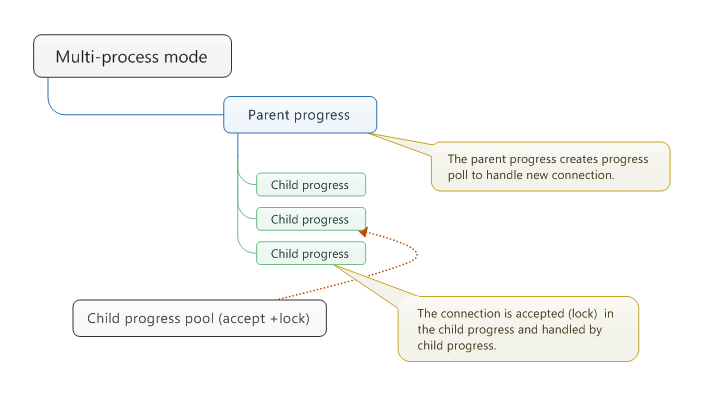
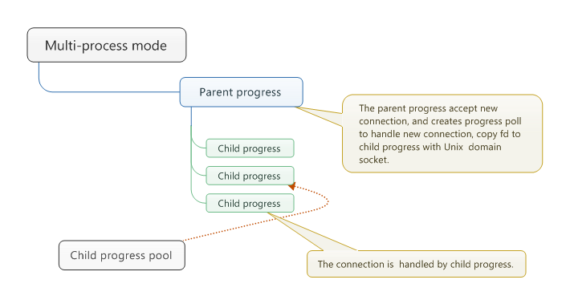
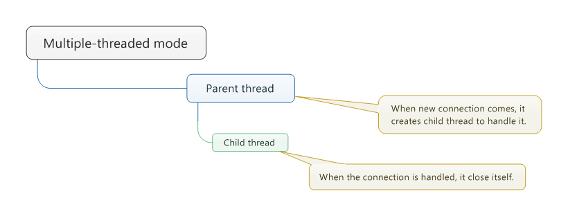
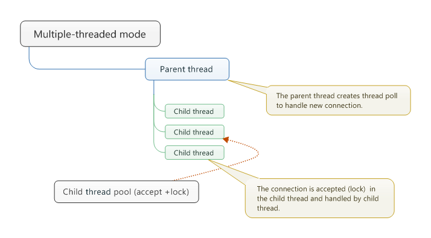
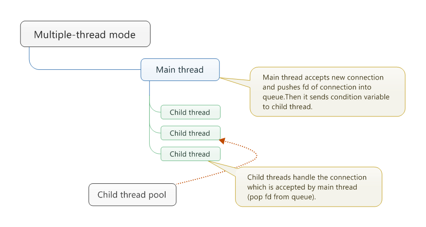
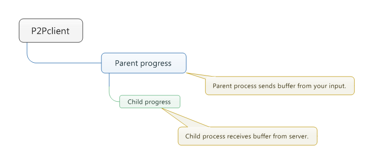
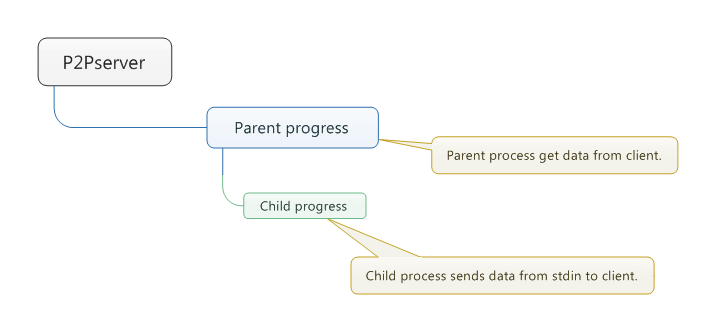

TCP Server and Client from UNP
---

###client_test
This is a simple test programe  as a client, which is used by server1 - server7.

Usage:

```shell

#etc: client_test -p 192.168.1.109 -c 500 -t 5 
./client_test [-p address] [-c number of connections] [-t number of child progress]

```

###server1
It is multi-process mode.When new connection comes, it fork child progress to handle it.

<center></center>
<div align = "center">server1 structure</div>

###server2
It is multi-process mode.The parent progress creates progress poll to handle new connection.The connection is *accepted* in the child progress.

Usage:

```shell

#etc: ./server2 -t 15 
./server2  [-t number of child progress]

```
<center></center>
<div align = "center">server2 structure</div>

###server3
It is multi-process mode.The parent progress creates progress poll to handle new connection.The connection is *accepted(+lock)* in the child progress.

Usage:

```shell

#etc: ./server3 -t 15 
./server3  [-t number of child progress]

```
<center></center>
<div align = "center">server3 structure</div>

###server4
It is multi-process mode.The parent progress acccepts new connection, then *copy file descripter* of connection to child process pool, which handles the connection. 

Usage:

```shell

#etc: ./server4 -t 15 
./server4  [-t number of child progress]

```
<center></center>
<div align = "center">server4 structure</div>

###server5
Is is multiple-threaded mode.When new connection comes, main thread creates  child thread to handle it.
<center></center>
<div align = "center">server5 structure</div>

###server6
Is is multiple-threaded mode.Main thread create child thread pool to handle connection from client.The connection is *accepted(+lock)* in the child thread.

Usage:

```shell

#etc: ./server6 -t 15 
./server6  [-t number of child thread]

```
<center></center>
<div align = "center">server6 structure</div>

###server7
Is is multiple-threaded mode.Main thread accept new connection, and child thread handle the connection.

Usage:

```shell

#etc: ./server7 -t 15 
./server7  [-t number of child thread]

```
<center></center>
<div align = "center">server7 structure</div>


###client
It is a  P2P client with select, Which can receive data from server and send data from stdin to server. 

###p2pclient

It is a  P2P client with a parent progress and a child progress.

<center></center>
<div align = "center">p2pclient structure</div>


###p2pserver
Parent process get data from client, child process send data from stdin to client.When parent process detects that client is closed, it 
closes itself and send siganl to child process to let child process close.

<center></center>
<div align = "center">p2pserver structure</div>
